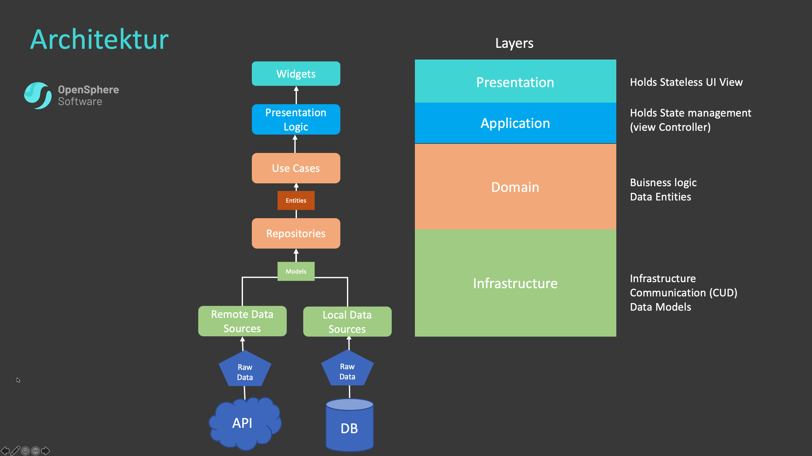
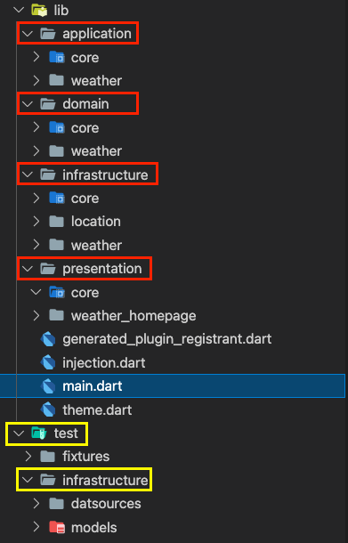

# Weather App - Clean Architecture

[//]: # (Add other badges such as version, build bagdges here)

**A Weather App as Example how to write a Clean Testable Code Base**  

# Table of Contents
1. [Supported devices](#supported-devices)  
2. [Prerequisites](#prerequisites)
3. [Architecture Model](#architecture-model)  
4. [Folder Structure](#folder-structure)  
4. [General Info](#general-info)  

## Supported devices
* Android
* iOS

## Prerequisites
* Flutter Version > 2.5.0

## Architecture Model:
The Architecture follows a Clean Architecture model. Each layer is seperated from each other and replacable. With this project Architecture the goal was to create a scalable application whis is also easy to test. 
Also this architecture allows us an easy way to deal with exceptions and Failures. Every Exception will turn into an self defined Failure with which we can deel in the presentation layer (or not). To give the opportunity to return either a failure or the data (fucntional programming pattern) i used the package dartz to create some more functional code. 
I worked with dependency injection and wrote interfaces for each layer to allow easy testing. For DI i used the package GetIT. For testing i used mockito. 

## Folder Structure:
The Folder Structure follows the architecture design. 
Each layer is seperated in Features (here only weather feature). Per Feature we add another folder to the layer. Core things used arccross features we place in core folders in each layer (such as exceptions, failures...). 
Repositorie are defined in the domain layer but implemented in the infrastructure layer. 

## General Info:
As general info i wantet to say that i didnt spent much time to the UI as i think this was not the important task here to this project. 
I also added the ability to easy add another features (such as the feature with the current location). I added the Funtionality (but didnt implemented it). To add this feature you just would create another bloc event to trigger and call the other usecase .. repo function .. datasource.  I added for this already a small location service which would be triggerd in the repository implementation before calling weather datasource.
I didnt implemented it cause i dont want to spent to much time on this little thing here as pre Work... But i think the task done. I hope you like it. 
I also added a few tests in the test folder for the infrastructure layer. Just for me to check if my datasource and model works. Ceck it out. 

Best Regards
Max

